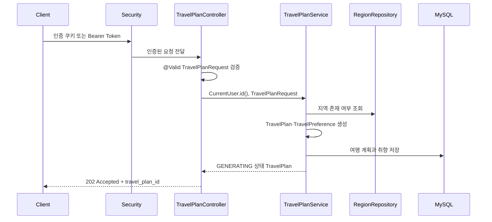

# 여행 생성·취향 코드 가이드

이 문서는 현재 v1 와이어프레임에 포함된 여행 생성 화면을 기준으로 작성했다. 현재 백엔드 구현 범위는 다음 두 기능이다.

- 지역 목록 조회: `GET /api/regions`
- 여행 생성 요청: `POST /api/travel-plans`
  - 여행 기본 정보 생성(`TravelPlan`)
  - 여행 취향 생성(`TravelPreference`)

사용자가 장소를 검색하거나 필수 방문 장소를 선택하는 기능은 아직 개발 범위가 아니다. 따라서 현재 서비스는 카카오맵 API를 호출하지 않고, 장소를 저장하지도 않는다. 프론트가 과도기적으로 `required_places`를 함께 보내더라도 요청 DTO가 알 수 없는 필드로 무시한다. 프론트 코드는 이 변경에서 수정하지 않는다.

## 1. 전체 처리 흐름



핵심 원칙은 다음과 같다.

1. 컨트롤러는 HTTP 요청을 DTO로 받고 인증된 사용자 ID를 서비스에 전달한다.
2. `@Valid`는 요청 DTO의 기본 형식·범위를 검증한다.
3. 서비스는 지역 존재 여부, 과거 일시, 취향 목록 중복처럼 여러 필드가 함께 판단되어야 하는 규칙을 확인한다.
4. 엔티티 팩토리는 서비스 외부에서 호출되더라도 도메인 불변식을 다시 확인한다.
5. `TravelPlan`을 저장하면 연결된 `TravelPreference`, 테마, 음식이 cascade로 함께 저장된다.

## 2. 계층별 역할

| 계층 | 책임 | 대표 파일 |
| --- | --- | --- |
| Controller | HTTP 경로 연결, 인증 사용자 식별, DTO 검증 시작, 응답 상태·형식 지정 | `TravelPlanController`, `RegionController` |
| Service | 여행 생성 순서 조합, 지역 조회, 업무 규칙 검증, 엔티티 생성·저장 | `TravelPlanService` |
| Repository | JPA를 이용한 지역·여행 계획 조회와 저장 | `RegionRepository`, `TravelPlanRepository` |
| DTO | JSON 입력·출력 계약과 Bean Validation 규칙 선언 | `TravelPlanRequest`, `TravelPreferenceRequest` 등 |
| Entity | DB 매핑, 객체 관계, 생성 시 도메인 불변식 보장 | `TravelPlan`, `TravelPreference` 등 |

## 3. Controller

### 3.1 `TravelPlanController`

파일: [`src/main/java/com/audigo/domain/travel/controller/TravelPlanController.java`](../src/main/java/com/audigo/domain/travel/controller/TravelPlanController.java)

`POST /api/travel-plans`를 처리한다.

```java
@PostMapping
@ResponseStatus(HttpStatus.ACCEPTED)
public ApiResponse<TravelPlanCreatedResponse> createTravelPlan(
        @Valid @RequestBody TravelPlanRequest request
) {
    TravelPlan travelPlan = travelPlanService.createTravelPlan(currentUser.id(), request);
    return ApiResponse.of("여행 생성 요청", TravelPlanCreatedResponse.from(travelPlan));
}
```

처리 순서는 다음과 같다.

1. Spring Security가 인증을 확인한다.
2. `@RequestBody`가 JSON 본문을 `TravelPlanRequest`로 변환한다.
3. `@Valid`가 DTO의 `@NotNull`, `@Min`, `@Max`, `@AssertTrue` 등을 실행한다.
4. `currentUser.id()`로 로그인한 사용자의 ID를 가져온다. 사용자 ID를 요청 JSON에서 받지 않는 이유는 다른 사용자의 ID를 임의로 전달하지 못하게 하기 위해서다.
5. `TravelPlanService.createTravelPlan(...)`이 여행과 취향을 만든다.
6. `TravelPlanCreatedResponse.from(...)`이 엔티티를 응답 전용 DTO로 변환한다.
7. HTTP 상태 `202 Accepted`와 여행 ID, 초기 상태를 반환한다.

현재 응답은 AI 작업 완료 결과가 아니라 저장된 요청의 초기 상태를 의미한다.

```json
{
  "message": "여행 생성 요청",
  "data": {
    "travel_plan_id": 55,
    "status": "GENERATING"
  }
}
```

### 3.2 `RegionController`

파일: [`src/main/java/com/audigo/domain/travel/controller/RegionController.java`](../src/main/java/com/audigo/domain/travel/controller/RegionController.java)

`GET /api/regions`를 처리한다. 서비스가 `fullName` 오름차순으로 조회한 지역 목록을 `RegionResponse`로 변환해 응답한다. 조회 결과가 없으면 오류가 아니라 빈 배열을 반환한다.

## 4. DTO

DTO는 외부 JSON의 모양과 입력 검증 규칙을 표현한다. 컨트롤러의 `@Valid`가 최상위 DTO에서 시작되고, `preference`에는 `@Valid`가 붙어 중첩 DTO 검증까지 전파된다.

### 4.1 `TravelPlanRequest`

파일: [`src/main/java/com/audigo/domain/travel/dto/TravelPlanRequest.java`](../src/main/java/com/audigo/domain/travel/dto/TravelPlanRequest.java)

| 필드 | JSON 이름 | 검증 |
| --- | --- | --- |
| `regionId` | `region_id` | `@NotNull` |
| `arrivalDatetime` | `arrival_datetime` | `@NotNull` |
| `departureDatetime` | `departure_datetime` | `@NotNull` |
| `headcount` | `headcount` | `@NotNull`, 1~30 |
| `companionType` | `companion_type` | `@NotNull` |
| `preference` | `preference` | `@NotNull`, `@Valid` |

객체 수준 검증은 다음과 같다.

- `isTravelPeriodValid()`: 도착 일시가 출발 일시보다 앞서야 한다.
- `isHeadcountCompatibleWithCompanion()`: `SOLO`는 1명, 그 외 동행 유형은 2명 이상이어야 한다.

`@JsonIgnoreProperties(ignoreUnknown = true)`가 붙어 있으므로 현재 DTO에 정의되지 않은 `required_places`가 프론트 요청에 남아 있어도 무시된다. 이는 장소 기능을 구현했다는 의미가 아니며, 프론트 변경 없이 현재 범위만 처리하기 위한 호환 설정이다.

### 4.2 `TravelPreferenceRequest`

파일: [`src/main/java/com/audigo/domain/travel/dto/TravelPreferenceRequest.java`](../src/main/java/com/audigo/domain/travel/dto/TravelPreferenceRequest.java)

| 필드 | JSON 이름 | 검증 |
| --- | --- | --- |
| `paceType` | `pace_type` | `@NotNull` |
| `transportType` | `transport_type` | `@NotNull` |
| `budgetMin` | `budget_min` | `@NotNull`, 0~3,000,000 |
| `budgetMax` | `budget_max` | `@NotNull`, 0~3,000,000 |
| `budgetType` | `budget_type` | `@NotNull` |
| `distancePreference` | `distance_preference` | `@NotNull`, 0~100 |
| `themes` | `themes` | 목록 자체 `@NotNull`, 최대 3개, 각 값 `@NotNull` |
| `foods` | `foods` | 목록 및 각 값 `@NotNull` |
| `extraRequest` | `extra_request` | 최대 300자 |

추가 객체 수준 검증:

- `isBudgetRangeValid()`: 최소 예산이 최대 예산보다 작거나 같은지 확인한다. 같은 값은 허용한다.
- 컴팩트 생성자는 테마가 null이면 null로 유지해 `@NotNull`이 동작하게 한다.
- 음식 목록이 null이면 빈 목록으로 바꾸고, 추가 요청이 null이면 빈 문자열로 바꾸며 앞뒤 공백을 제거한다.

테마와 음식은 누락(null)은 거부하지만, 현재 와이어프레임에서 선택하지 않은 상태를 표현할 수 있도록 빈 배열은 허용한다. 테마는 최대 3개이고 서비스와 엔티티에서 중복도 거부한다.

### 4.3 출력 DTO

- [`RegionResponse`](../src/main/java/com/audigo/domain/travel/dto/RegionResponse.java): 지역을 `region_id`, `name`, `full_name`으로 변환한다.
- [`TravelPlanCreatedResponse`](../src/main/java/com/audigo/domain/travel/dto/TravelPlanCreatedResponse.java): 생성된 여행의 `travel_plan_id`와 `status`만 반환한다.

프로젝트의 Jackson 전역 설정은 기본적으로 `SNAKE_CASE`이고, API 필드명이 명확해야 하는 DTO에는 `@JsonProperty`가 함께 선언되어 있다.

## 5. Service

파일: [`src/main/java/com/audigo/domain/travel/service/TravelPlanService.java`](../src/main/java/com/audigo/domain/travel/service/TravelPlanService.java)

클래스 기본 트랜잭션은 `@Transactional(readOnly = true)`이고, 생성 메서드에는 `@Transactional`이 적용된다. 생성 중 예외가 발생하면 여행 계획과 취향 저장이 함께 롤백된다.

### 5.1 지역 목록 조회

`getRegions()`는 `RegionRepository.findAllByOrderByFullNameAsc()`를 호출한다. 즉 지역의 `fullName`을 기준으로 오름차순 정렬한 뒤 각 엔티티를 `RegionResponse`로 바꾼다.

### 5.2 여행과 취향 생성 순서

`createTravelPlan(userId, request)`는 다음 순서로 동작한다.

1. `validateRequest(request)`로 도착 일시와 테마·음식 중복을 확인한다.
2. `regionRepository.findById(request.regionId())`로 지역을 조회한다. 지역이 없으면 `REGION_NOT_FOUND`를 발생시킨다.
3. `TravelPlan.create(...)`로 여행 기본 정보를 만들고 초기 상태를 `GENERATING`으로 설정한다.
4. `createPreference(...)`가 요청 DTO의 취향 값을 `TravelPreference.create(...)`에 전달한다.
5. `travelPlan.attachPreference(preference)`로 여행과 취향의 1:1 관계를 연결한다.
6. `travelPlanRepository.save(travelPlan)`으로 저장한다. `TravelPlan.preference`의 cascade 설정에 따라 취향과 테마·음식 연결 엔티티도 함께 저장된다.
7. 저장된 `TravelPlan`을 컨트롤러에 반환한다.

현재 `createPreference`는 별도 HTTP 엔드포인트가 아니다. 여행 생성 요청 안의 `preference` 객체를 저장하는 내부 생성 로직이다.

### 5.3 서비스 검증

#### 요청 시각

DTO가 도착 일시와 출발 일시의 순서를 확인하고, 서비스는 도착 일시가 현재보다 과거인지 다시 확인한다. 과거 요청은 `VALIDATION_FAILED`다.

#### 취향 중복

서비스는 테마와 음식 목록을 `HashSet`으로 바꾼 뒤 크기를 비교한다. 중복 값이 있으면 집합의 크기가 원래 목록보다 작아지므로 `VALIDATION_FAILED`를 발생시킨다. 이 검증은 DTO의 개수·null 검증과 별개로, 목록 안의 값 관계를 확인하기 위한 것이다.

#### 인증 사용자

서비스는 사용자 탈퇴·정지 기능을 전제로 한 활성 상태 재조회는 하지 않는다. 컨트롤러가 인증 컨텍스트에서 얻은 `CurrentUser.id()`만 사용해 `TravelPlan.userId`에 저장한다.

## 6. Repository

모든 레포지토리는 Spring Data JPA의 `JpaRepository`를 상속한다.

| 레포지토리 | 역할 | 사용자 정의 메서드 |
| --- | --- | --- |
| [`TravelPlanRepository`](../src/main/java/com/audigo/domain/travel/repository/TravelPlanRepository.java) | 여행 계획 CRUD | 없음 |
| [`RegionRepository`](../src/main/java/com/audigo/domain/travel/repository/RegionRepository.java) | 지역 CRUD·정렬 목록 조회 | `findAllByOrderByFullNameAsc()` |

서비스가 직접 SQL을 작성하지 않고 레포지토리 메서드를 호출하면 Spring Data JPA가 엔티티 매핑을 기준으로 조회·저장을 수행한다.

## 7. Entity

### 7.1 `TravelPlan`

파일: [`src/main/java/com/audigo/domain/travel/entity/TravelPlan.java`](../src/main/java/com/audigo/domain/travel/entity/TravelPlan.java)

`travel_plans` 테이블에 여행 기본 조건과 생성 상태를 저장한다.

- 사용자 ID, 지역, 도착·출발 일시
- 인원(1~30명)
- 동행 유형
- 생성 상태(`GENERATING`, `COMPLETED`, `FAILED`)
- `TravelPreference`와의 1:1 관계
- 생성·수정 시각

`TravelPlan.create(...)`는 다음 불변식을 확인한다.

- 사용자 ID, 지역, 일시, 동행 유형은 필수다.
- 도착 일시는 출발 일시보다 앞서야 한다.
- `SOLO`는 1명, 그 외 유형은 2명 이상이어야 한다.

### 7.2 `TravelPreference`

파일: [`src/main/java/com/audigo/domain/travel/entity/TravelPreference.java`](../src/main/java/com/audigo/domain/travel/entity/TravelPreference.java)

`travel_preferences` 테이블에 여행 취향을 저장한다. `travel_plan_id`는 unique 제약이 있는 1:1 소유 관계다.

- 여행 속도, 이동 수단, 예산 최소·최대, 예산 유형
- 거리 선호도(0~100)
- 추가 요청(최대 300자)
- `TravelPreferenceTheme` 1:N
- `TravelPreferenceFood` 1:N

`TravelPreference.create(...)`는 서비스와 별도로 다음을 다시 확인한다.

- 필수 enum 값이 null이 아님
- 예산이 0~3,000,000이고 최소값이 최대값보다 크지 않음
- 거리 선호도가 0~100임
- 테마가 최대 3개이고 중복되지 않음
- 음식 목록이 중복되지 않음
- 추가 요청을 trim하고 300자를 넘지 않음

테마와 음식 연결 엔티티에는 `cascade = ALL`, `orphanRemoval = true`가 적용된다. getter는 외부에서 내부 컬렉션을 직접 변경할 수 없도록 읽기 전용 뷰를 반환한다.

### 7.3 `Region`

파일: [`src/main/java/com/audigo/domain/travel/entity/Region.java`](../src/main/java/com/audigo/domain/travel/entity/Region.java)

`regions` 테이블에 지역명과 전체 지역명을 저장한다. 이름은 null·빈 문자열·길이를 확인하고 trim하며, `full_name`은 unique 제약을 가진다.

### 7.4 취향 연결 엔티티

- [`TravelPreferenceTheme`](../src/main/java/com/audigo/domain/travel/entity/TravelPreferenceTheme.java): 취향 ID와 테마 enum을 저장한다.
- [`TravelPreferenceFood`](../src/main/java/com/audigo/domain/travel/entity/TravelPreferenceFood.java): 취향 ID와 음식 enum을 저장한다.

두 엔티티는 여행 취향의 자식 데이터이며, 취향 저장 시 cascade로 함께 저장된다.

## 8. 검증 단계와 오류

### 8.1 요청 바인딩 단계

컨트롤러의 `@Valid`가 다음을 처리한다.

- 필수값: `@NotNull`
- 수치 범위: `@Min`, `@Max`
- 목록 항목: `List<@NotNull ...>`
- 문자열 길이: `@Size`
- 중첩 DTO: `@Valid`
- 객체 간 규칙: `@AssertTrue`

검증 실패 시 전역 예외 처리기가 validation 오류 응답을 만든다. 이 단계는 JSON이 DTO 규칙에 맞는지를 확인하는 단계다.

### 8.2 서비스·엔티티 단계

DTO 애너테이션만으로 표현하기 어려운 지역 존재 여부, 과거 일시, 테마·음식 중복은 서비스가 확인한다. 엔티티 팩토리는 서비스 밖에서 호출되는 경우에도 기본 불변식을 다시 확인한다.

현재 여행 흐름에서 사용하는 주요 오류는 다음과 같다.

| 상황 | 오류 코드 |
| --- | --- |
| 지역 없음 | `REGION_NOT_FOUND` |
| 여행 조건·중복·범위 오류 | `VALIDATION_FAILED` |

## 9. 데이터 저장 관계

```text
TravelPlan
 ├─ N:1 Region
 └─ 1:1 TravelPreference
      ├─ 1:N TravelPreferenceTheme
      └─ 1:N TravelPreferenceFood
```

여행 생성 요청 하나가 성공하면 다음 데이터가 하나의 트랜잭션 안에서 저장된다.

1. `travel_plans`
2. `travel_preferences`
3. `travel_preference_themes`
4. `travel_preference_foods`

장소 테이블이나 카카오맵 API 호출은 이 흐름에 포함되지 않는다.

## 10. 현재 범위 밖의 후속 기능

- 카카오맵 키워드 검색·장소 상세 조회
- 장소 선택·필수 장소 저장
- AI 생성 작업 생성·실행·폴링
- 생성된 일정·경로 저장

현재 `GENERATING`은 향후 AI 생성을 연결하기 위한 초기 상태일 뿐, 이 코드가 AI 생성을 완료하거나 상태를 변경하지는 않는다.

## 11. 변경 시 확인할 체크리스트

- 입력 JSON 이름이 snake_case 계약과 일치하는가?
- `TravelPlanRequest`와 `TravelPreferenceRequest`의 기본 검증을 갱신했는가?
- 서비스와 엔티티가 같은 예산·중복 규칙을 사용하는가?
- `TravelPlan`의 preference owning side가 연결되어 있는가?
- 장소·카카오맵 로직을 현재 v1 범위에 실수로 포함하지 않았는가?
- 생성 로직 변경 후 `TravelPlanServiceTest`와 DTO 검증 테스트를 실행했는가?
