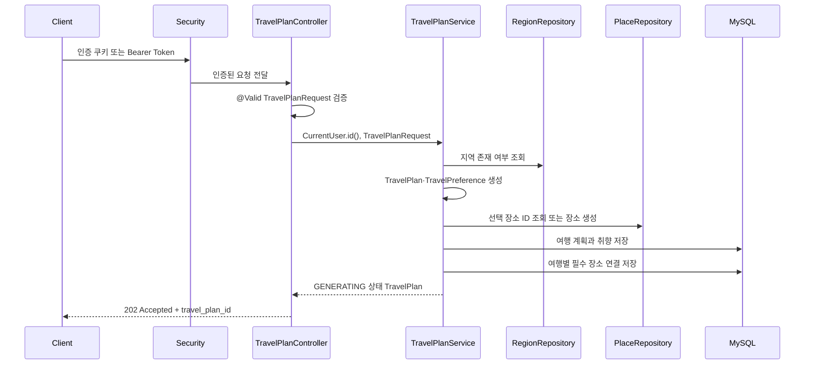

# 여행 생성·취향·필수 장소 코드 가이드

이 문서는 현재 v1 와이어프레임의 여행 생성 화면을 기준으로 작성했다. 현재 백엔드 구현 범위는 다음과 같다.

> 최종 장소 스키마는 사용자가 이 대화에서 제공한 ERD 기준을 따른다. `places`에는 `id`, `provider`, `provider_place_id`, `created_at`만 저장하며 `place_name`은 검색·화면 표시용으로만 사용한다.
> 장소 생성 요청에 포함된 `place_name`, `address`, `latitude`, `longitude`는 저장하지 않고 요청 처리 중 AI 입력 컨텍스트로만 사용한다.

- 지역 목록 조회: `GET /api/regions`
- 여행 생성 요청: `POST /api/travel-plans`
  - 여행 기본 정보 생성(`TravelPlan`)
  - 여행 취향 생성(`TravelPreference`)
- 장소 검색: `GET /api/places/search?region_id=1&keyword=성산일출봉&page=1&size=15`
  - 백엔드가 지역 범위를 반영해 카카오 키워드 검색 API를 호출한다.
  - 주소·위도·경도는 검색 응답과 화면 표시를 위한 값이며 저장하지 않는다.
- 필수 장소 저장: `POST /api/travel-plans`의 `required_places`
  - 선택된 장소의 `provider`, 카카오 `provider_place_id`만 `places`에 저장한다.
  - `id`는 DB가 발급하고 `created_at`은 저장 시각으로 자동 생성한다.
  - 장소 이름, 주소·위도·경도와 카카오 원본 `category`는 저장하지 않는다.
  - 한 여행에서 같은 제공자·장소 ID를 두 번 등록할 수 없다.

장소 선택은 선택 사항이다. `required_places`를 생략하거나 빈 배열로 보내면 여행 계획과 취향만 저장된다.

## 1. 전체 처리 흐름



핵심 원칙은 다음과 같다.

1. 컨트롤러는 HTTP 요청을 DTO로 받고 인증된 사용자 ID를 서비스에 전달한다.
2. `@Valid`는 요청 DTO의 기본 형식·범위를 검증한다.
3. 서비스는 지역 존재 여부, 과거 일시, 취향 목록 중복처럼 여러 필드가 함께 판단되어야 하는 규칙을 확인한다.
4. 엔티티 팩토리는 서비스 외부에서 호출되더라도 도메인 불변식을 다시 확인한다.
5. `TravelPlan`을 저장하면 연결된 `TravelPreference`, 테마, 음식이 cascade로 함께 저장된다.

## 2. 계층별 역할

| 계층 | 책임 | 대표 파일 |
| --- | --- | --- |
| Controller | HTTP 경로 연결, 인증 사용자 식별, DTO 검증 시작, 응답 상태·형식 지정 | `TravelPlanController`, `RegionController`, `PlaceController` |
| Service | 여행 생성 순서 조합, 카카오 검색 중계, 지역·장소 조회, 업무 규칙 검증, 엔티티 생성·저장 | `TravelPlanService`, `KakaoPlaceSearchService` |
| Repository | JPA를 이용한 지역·여행·장소 조회와 저장 | `RegionRepository`, `TravelPlanRepository`, `PlaceRepository`, `TravelPlanPlaceRepository` |
| DTO | JSON 입력·출력 계약과 Bean Validation 규칙 선언 | `TravelPlanRequest`, `TravelPreferenceRequest`, `RequiredPlaceRequest`, `PlaceSearchResponse` |
| Entity | DB 매핑, 객체 관계, 생성 시 도메인 불변식 보장 | `TravelPlan`, `TravelPreference`, `Place`, `TravelPlanPlace` 등 |

## 3. Controller

### 3.1 `TravelPlanController`

파일: [`src/main/java/com/audigo/domain/travel/controller/TravelPlanController.java`](../src/main/java/com/audigo/domain/travel/controller/TravelPlanController.java)

`POST /api/travel-plans`를 처리한다.

```java
@PostMapping
@ResponseStatus(HttpStatus.ACCEPTED)
public ApiResponse<TravelPlanCreatedResponse> createTravelPlan(
        @Valid @RequestBody TravelPlanRequest request
) {
    TravelPlan travelPlan = travelPlanService.createTravelPlan(currentUser.id(), request);
    return ApiResponse.of("여행 생성 요청", TravelPlanCreatedResponse.from(travelPlan));
}
```

처리 순서는 다음과 같다.

1. Spring Security가 인증을 확인한다.
2. `@RequestBody`가 JSON 본문을 `TravelPlanRequest`로 변환한다.
3. `@Valid`가 DTO의 `@NotNull`, `@Min`, `@Max`, `@AssertTrue` 등을 실행한다.
4. `currentUser.id()`로 로그인한 사용자의 ID를 가져온다. 사용자 ID를 요청 JSON에서 받지 않는 이유는 다른 사용자의 ID를 임의로 전달하지 못하게 하기 위해서다.
5. `TravelPlanService.createTravelPlan(...)`이 여행과 취향을 만든다.
6. `TravelPlanCreatedResponse.from(...)`이 엔티티를 응답 전용 DTO로 변환한다.
7. HTTP 상태 `202 Accepted`와 여행 ID, 초기 상태를 반환한다.

현재 응답은 AI 작업 완료 결과가 아니라 저장된 요청의 초기 상태를 의미한다.

```json
{
  "message": "여행 생성 요청",
  "data": {
    "travel_plan_id": 55,
    "status": "GENERATING"
  }
}
```

### 3.2 `RegionController`

파일: [`src/main/java/com/audigo/domain/travel/controller/RegionController.java`](../src/main/java/com/audigo/domain/travel/controller/RegionController.java)

`GET /api/regions`를 처리한다. 서비스가 `fullName` 오름차순으로 조회한 지역 목록을 `RegionResponse`로 변환해 응답한다. 조회 결과가 없으면 오류가 아니라 빈 배열을 반환한다.

### 3.3 `PlaceController`

파일: [`src/main/java/com/audigo/domain/travel/controller/PlaceController.java`](../src/main/java/com/audigo/domain/travel/controller/PlaceController.java)

`GET /api/places/search?region_id=지역ID&keyword=장소명&page=1&size=15`를 처리한다. 실제 카카오 검색 API 호출은 `KakaoPlaceSearchService`가 담당하고, 컨트롤러는 지역 ID·검색어·페이지·크기를 전달한 뒤 `PlaceSearchResponse`를 응답한다. 카카오 API 키가 없거나 외부 호출이 실패하면 서비스 불가·외부 API 오류로 처리한다.

검색 API는 먼저 지역이 존재하는지 확인하고, 카카오에 보낼 검색어를 `지역 full_name + 검색어`로 조합한다. `size`는 최대 15건, 전체 결과는 최대 45건 범위로 제한한다. 검색만으로는 장소를 DB에 저장하지 않는다.

로컬 실행 시 백엔드에는 `KAKAO_REST_API_KEY`를 설정해야 한다. 프론트에서 실제 JS 지도를 표시하려면 프론트 환경 변수 `VITE_KAKAO_JS_KEY`도 별도로 설정해야 한다. REST 키와 JavaScript 키는 카카오 개발자 콘솔에서 용도가 다른 키이므로 같은 값을 재사용하지 않는다.

## 4. DTO

DTO는 외부 JSON의 모양과 입력 검증 규칙을 표현한다. 컨트롤러의 `@Valid`가 최상위 DTO에서 시작되고, `preference`에는 `@Valid`가 붙어 중첩 DTO 검증까지 전파된다.

### 4.1 `TravelPlanRequest`

파일: [`src/main/java/com/audigo/domain/travel/dto/TravelPlanRequest.java`](../src/main/java/com/audigo/domain/travel/dto/TravelPlanRequest.java)

| 필드 | JSON 이름 | 검증 |
| --- | --- | --- |
| `regionId` | `region_id` | `@NotNull` |
| `arrivalDatetime` | `arrival_datetime` | `@NotNull` |
| `departureDatetime` | `departure_datetime` | `@NotNull` |
| `headcount` | `headcount` | `@NotNull`, 1~30 |
| `companionType` | `companion_type` | `@NotNull` |
| `preference` | `preference` | `@NotNull`, `@Valid` |
| `requiredPlaces` | `required_places` | 선택값, 각 항목 `@Valid` |

객체 수준 검증은 다음과 같다.

- `isTravelPeriodValid()`: 도착 일시가 출발 일시보다 앞서야 한다.
- `isHeadcountCompatibleWithCompanion()`: `SOLO`는 1명, 그 외 동행 유형은 2명 이상이어야 한다.

`required_places`가 없으면 컴팩트 생성자에서 빈 목록으로 바뀐다. 따라서 장소 등록은 필수가 아니다. 알 수 없는 추가 필드는 기존처럼 무시해 버전 호환성을 유지한다.

각 `RequiredPlaceRequest`는 `provider`, 카카오 장소 ID(`provider_place_id`), 장소명, 주소, 위도·경도를 검증한다. 이 값들은 요청 처리 중 AI 입력 컨텍스트로만 사용하고 `Place` 엔티티에는 저장하지 않는다. `place_type`이 생략되면 우리 서비스의 기본 분류인 `TOURISM`으로 처리하며, 카카오 원본 `category`는 사용하지 않는다.

### 4.2 `TravelPreferenceRequest`

파일: [`src/main/java/com/audigo/domain/travel/dto/TravelPreferenceRequest.java`](../src/main/java/com/audigo/domain/travel/dto/TravelPreferenceRequest.java)

| 필드 | JSON 이름 | 검증 |
| --- | --- | --- |
| `paceType` | `pace_type` | `@NotNull` |
| `transportType` | `transport_type` | `@NotNull` |
| `budgetMin` | `budget_min` | `@NotNull`, 0~3,000,000 |
| `budgetMax` | `budget_max` | `@NotNull`, 0~3,000,000 |
| `budgetType` | `budget_type` | `@NotNull` |
| `distancePreference` | `distance_preference` | `@NotNull`, 0~100 |
| `themes` | `themes` | 목록 자체 `@NotNull`, 최대 3개, 각 값 `@NotNull` |
| `foods` | `foods` | 목록 및 각 값 `@NotNull` |
| `extraRequest` | `extra_request` | 최대 300자 |

추가 객체 수준 검증:

- `isBudgetRangeValid()`: 최소 예산이 최대 예산보다 작거나 같은지 확인한다. 같은 값은 허용한다.
- 컴팩트 생성자는 테마가 null이면 null로 유지해 `@NotNull`이 동작하게 한다.
- 음식 목록이 null이면 빈 목록으로 바꾸고, 추가 요청이 null이면 빈 문자열로 바꾸며 앞뒤 공백을 제거한다.

테마와 음식은 누락(null)은 거부하지만, 현재 와이어프레임에서 선택하지 않은 상태를 표현할 수 있도록 빈 배열은 허용한다. 테마는 최대 3개이고 서비스와 엔티티에서 중복도 거부한다.

### 4.3 출력 DTO

- [`RegionResponse`](../src/main/java/com/audigo/domain/travel/dto/RegionResponse.java): 지역을 `region_id`, `name`, `full_name`으로 변환한다.
- [`TravelPlanCreatedResponse`](../src/main/java/com/audigo/domain/travel/dto/TravelPlanCreatedResponse.java): 생성된 여행의 `travel_plan_id`와 `status`만 반환한다.
- [`PlaceSearchResponse`](../src/main/java/com/audigo/domain/travel/dto/PlaceSearchResponse.java): 카카오 검색 결과 목록과 페이지 메타데이터를 반환한다.
- [`PlaceSearchItemResponse`](../src/main/java/com/audigo/domain/travel/dto/PlaceSearchItemResponse.java): 화면 표시용 `provider`, `provider_place_id`, `place_name`, 주소, 위도·경도를 담는다. 백엔드는 위도·경도를 `BigDecimal`로 변환해 정밀도를 유지하고, 검색 응답의 주소·좌표는 영속화하지 않는다.

프로젝트의 Jackson 전역 설정은 기본적으로 `SNAKE_CASE`이고, API 필드명이 명확해야 하는 DTO에는 `@JsonProperty`가 함께 선언되어 있다.

## 5. Service

파일: [`src/main/java/com/audigo/domain/travel/service/TravelPlanService.java`](../src/main/java/com/audigo/domain/travel/service/TravelPlanService.java)

클래스 기본 트랜잭션은 `@Transactional(readOnly = true)`이고, 생성 메서드에는 `@Transactional`이 적용된다. 생성 중 예외가 발생하면 여행 계획과 취향 저장이 함께 롤백된다.

### 5.1 지역 목록 조회

`getRegions()`는 `RegionRepository.findAllByOrderByFullNameAsc()`를 호출한다. 즉 지역의 `fullName`을 기준으로 오름차순 정렬한 뒤 각 엔티티를 `RegionResponse`로 바꾼다.

### 5.2 여행과 취향 생성 순서

`createTravelPlan(userId, request)`는 다음 순서로 동작한다.

1. `validateRequest(request)`로 도착 일시와 테마·음식 중복을 확인한다.
2. `regionRepository.findById(request.regionId())`로 지역을 조회한다. 지역이 없으면 `REGION_NOT_FOUND`를 발생시킨다.
3. `TravelPlan.create(...)`로 여행 기본 정보를 만들고 초기 상태를 `GENERATING`으로 설정한다.
4. `createPreference(...)`가 요청 DTO의 취향 값을 `TravelPreference.create(...)`에 전달한다.
5. `travelPlan.attachPreference(preference)`로 여행과 취향의 1:1 관계를 연결한다.
6. `addRequiredPlaces(...)`가 필수 장소 중복을 확인하고, 장소 ID가 이미 있으면 기존 `Place`를 재사용한다. 새 장소라면 `provider`, `provider_place_id`만 `places`에 저장한다. `created_at`은 엔티티의 `@PrePersist`에서 생성된다. 요청의 장소명·주소·좌표는 이 저장 과정에서 버리지 않고 AI 입력 컨텍스트로 사용할 수 있지만 영속화하지 않는다.
7. `TravelPlanPlace`를 여행에 연결한다. 장소 순서와 `USER_REQUIRED` 출처, 내부 `PlaceType`을 저장하며 좌표는 저장하지 않는다.
8. `travelPlanRepository.save(travelPlan)`으로 저장한다. `TravelPlan.preference`와 `requiredPlaces`의 cascade 설정에 따라 취향·테마·음식·여행별 장소 연결도 함께 저장된다.
9. 저장된 `TravelPlan`을 컨트롤러에 반환한다.

현재 `createPreference`는 별도 HTTP 엔드포인트가 아니다. 여행 생성 요청 안의 `preference` 객체를 저장하는 내부 생성 로직이다.

### 5.3 서비스 검증

#### 요청 시각

DTO가 도착 일시와 출발 일시의 순서를 확인하고, 서비스는 도착 일시가 현재보다 과거인지 다시 확인한다. 과거 요청은 `VALIDATION_FAILED`다.

#### 취향 중복

서비스는 테마와 음식 목록을 `HashSet`으로 바꾼 뒤 크기를 비교한다. 중복 값이 있으면 집합의 크기가 원래 목록보다 작아지므로 `VALIDATION_FAILED`를 발생시킨다. 이 검증은 DTO의 개수·null 검증과 별개로, 목록 안의 값 관계를 확인하기 위한 것이다.

#### 필수 장소 중복

`provider`와 `provider_place_id`를 합친 식별자를 `HashSet`에 넣어 같은 장소가 한 요청에 여러 번 포함됐는지 확인한다. 중복이면 `DUPLICATED_REQUIRED_PLACE`를 반환한다. DB의 `places(provider, provider_place_id)`와 `travel_plan_places(travel_plan_id, place_id)` 유니크 제약도 같은 장소의 중복 저장을 한 번 더 방지한다.

#### 인증 사용자

서비스는 사용자 탈퇴·정지 기능을 전제로 한 활성 상태 재조회는 하지 않는다. 컨트롤러가 인증 컨텍스트에서 얻은 `CurrentUser.id()`만 사용해 `TravelPlan.userId`에 저장한다.

## 6. Repository

모든 레포지토리는 Spring Data JPA의 `JpaRepository`를 상속한다.

| 레포지토리 | 역할 | 사용자 정의 메서드 |
| --- | --- | --- |
| [`TravelPlanRepository`](../src/main/java/com/audigo/domain/travel/repository/TravelPlanRepository.java) | 여행 계획 CRUD | 없음 |
| [`RegionRepository`](../src/main/java/com/audigo/domain/travel/repository/RegionRepository.java) | 지역 CRUD·정렬 목록 조회 | `findAllByOrderByFullNameAsc()` |
| [`PlaceRepository`](../src/main/java/com/audigo/domain/travel/repository/PlaceRepository.java) | 카카오 장소 최소 정보 조회·저장 | `findByProviderAndProviderPlaceId()` |
| [`TravelPlanPlaceRepository`](../src/main/java/com/audigo/domain/travel/repository/TravelPlanPlaceRepository.java) | 여행과 필수 장소 연결 CRUD | 없음 |

서비스가 직접 SQL을 작성하지 않고 레포지토리 메서드를 호출하면 Spring Data JPA가 엔티티 매핑을 기준으로 조회·저장을 수행한다.

## 7. Entity

### 7.1 `TravelPlan`

파일: [`src/main/java/com/audigo/domain/travel/entity/TravelPlan.java`](../src/main/java/com/audigo/domain/travel/entity/TravelPlan.java)

`travel_plans` 테이블에 여행 기본 조건과 생성 상태를 저장한다.

- 사용자 ID, 지역, 도착·출발 일시
- 인원(1~30명)
- 동행 유형
- 생성 상태(`GENERATING`, `COMPLETED`, `FAILED`)
- `TravelPreference`와의 1:1 관계
- 생성·수정 시각

`TravelPlan.create(...)`는 다음 불변식을 확인한다.

- 사용자 ID, 지역, 일시, 동행 유형은 필수다.
- 도착 일시는 출발 일시보다 앞서야 한다.
- `SOLO`는 1명, 그 외 유형은 2명 이상이어야 한다.

### 7.2 `TravelPreference`

파일: [`src/main/java/com/audigo/domain/travel/entity/TravelPreference.java`](../src/main/java/com/audigo/domain/travel/entity/TravelPreference.java)

`travel_preferences` 테이블에 여행 취향을 저장한다. `travel_plan_id`는 unique 제약이 있는 1:1 소유 관계다.

- 여행 속도, 이동 수단, 예산 최소·최대, 예산 유형
- 거리 선호도(0~100)
- 추가 요청(최대 300자)
- `TravelPreferenceTheme` 1:N
- `TravelPreferenceFood` 1:N

`TravelPreference.create(...)`는 서비스와 별도로 다음을 다시 확인한다.

- 필수 enum 값이 null이 아님
- 예산이 0~3,000,000이고 최소값이 최대값보다 크지 않음
- 거리 선호도가 0~100임
- 테마가 최대 3개이고 중복되지 않음
- 음식 목록이 중복되지 않음
- 추가 요청을 trim하고 300자를 넘지 않음

테마와 음식 연결 엔티티에는 `cascade = ALL`, `orphanRemoval = true`가 적용된다. getter는 외부에서 내부 컬렉션을 직접 변경할 수 없도록 읽기 전용 뷰를 반환한다.

### 7.3 `Region`

파일: [`src/main/java/com/audigo/domain/travel/entity/Region.java`](../src/main/java/com/audigo/domain/travel/entity/Region.java)

`regions` 테이블에 지역명과 전체 지역명을 저장한다. 이름은 null·빈 문자열·길이를 확인하고 trim하며, `full_name`은 unique 제약을 가진다.

### 7.4 취향 연결 엔티티

- [`TravelPreferenceTheme`](../src/main/java/com/audigo/domain/travel/entity/TravelPreferenceTheme.java): 취향 ID와 테마 enum을 저장한다.
- [`TravelPreferenceFood`](../src/main/java/com/audigo/domain/travel/entity/TravelPreferenceFood.java): 취향 ID와 음식 enum을 저장한다.

두 엔티티는 여행 취향의 자식 데이터이며, 취향 저장 시 cascade로 함께 저장된다.

### 7.5 `Place`와 `TravelPlanPlace`

파일: [`src/main/java/com/audigo/domain/travel/entity/Place.java`](../src/main/java/com/audigo/domain/travel/entity/Place.java), [`src/main/java/com/audigo/domain/travel/entity/TravelPlanPlace.java`](../src/main/java/com/audigo/domain/travel/entity/TravelPlanPlace.java)

`Place`는 카카오 장소의 공유 가능한 최소 식별 정보다.

- `provider`: 현재 `KAKAO`
- `providerPlaceId`: 카카오 장소 ID
- `createdAt`: 장소 레코드 생성 시각

`Place.id`는 DB가 자동 발급하는 내부 기본키이고, `travel_plan_places.place_id`가 이 값을 참조한다. 프론트가 내부 `id`를 보내는 것이 아니라 `provider`와 `provider_place_id`로 장소를 식별한다.

장소 이름, 위도·경도, 주소, 카카오 원본 `category`, 장소 URL은 `Place`에 저장하지 않는다. 장소 이름·주소·좌표는 검색 응답과 지도 표시용으로만 사용한다.

`TravelPlanPlace`는 특정 여행에서 그 장소가 필수 방문인지와 순서를 연결한다. 현재 사용자가 추가한 장소는 `source=USER_REQUIRED`로 저장되고, `placeType`은 `RESTAURANT`, `ACCOMMODATION`, `TOURISM` 중 하나다. 카카오의 원본 카테고리를 그대로 저장하지 않는다.

## 8. 검증 단계와 오류

### 8.1 요청 바인딩 단계

컨트롤러의 `@Valid`가 다음을 처리한다.

- 필수값: `@NotNull`
- 수치 범위: `@Min`, `@Max`
- 목록 항목: `List<@NotNull ...>`
- 문자열 길이: `@Size`
- 중첩 DTO: `@Valid`
- 객체 간 규칙: `@AssertTrue`

검증 실패 시 전역 예외 처리기가 validation 오류 응답을 만든다. 이 단계는 JSON이 DTO 규칙에 맞는지를 확인하는 단계다.

### 8.2 서비스·엔티티 단계

DTO 애너테이션만으로 표현하기 어려운 지역 존재 여부, 과거 일시, 테마·음식 중복은 서비스가 확인한다. 엔티티 팩토리는 서비스 밖에서 호출되는 경우에도 기본 불변식을 다시 확인한다.

현재 여행 흐름에서 사용하는 주요 오류는 다음과 같다.

| 상황 | 오류 코드 |
| --- | --- |
| 지역 없음 | `REGION_NOT_FOUND` |
| 같은 여행에 같은 필수 장소를 중복 등록 | `DUPLICATED_REQUIRED_PLACE` |
| 여행 조건·중복·범위 오류 | `VALIDATION_FAILED` |

## 9. 데이터 저장 관계

```text
TravelPlan
 ├─ N:1 Region
 └─ 1:1 TravelPreference
      ├─ 1:N TravelPreferenceTheme
      └─ 1:N TravelPreferenceFood
      └─ 1:N TravelPlanPlace ── N:1 Place
```

여행 생성 요청 하나가 성공하면 다음 데이터가 하나의 트랜잭션 안에서 저장된다.

1. `travel_plans`
2. `travel_preferences`
3. `travel_preference_themes`
4. `travel_preference_foods`
5. `places` (선택 장소가 있을 때만)
6. `travel_plan_places` (선택 장소가 있을 때만)

장소가 없는 요청도 정상 처리된다. 장소가 있는 경우에도 좌표는 위 저장 목록에 포함되지 않는다.

## 10. 현재 범위 밖의 후속 기능

- AI 서버 작업 생성·상태 폴링·결과 저장
- 생성된 일정·경로 저장

현재 `GENERATING`은 여행·취향·선택 장소 저장이 완료되고 AI 작업을 시작할 준비가 된 상태다. AI 서버 URL과 작업 생성·상태 조회 계약이 확정되면 저장된 여행 조건과 요청 처리 중 확보한 장소명·주소·좌표를 하나의 AI 요청 DTO로 묶어 AI 어댑터에 전달해야 한다. 해당 장소 정보는 DB에 저장하지 않는다.

## 11. 변경 시 확인할 체크리스트

- 입력 JSON 이름이 snake_case 계약과 일치하는가?
- `TravelPlanRequest`와 `TravelPreferenceRequest`의 기본 검증을 갱신했는가?
- 서비스와 엔티티가 같은 예산·중복 규칙을 사용하는가?
- `TravelPlan`의 preference owning side가 연결되어 있는가?
- 장소 검색 결과에서 카카오 원본 `category`를 저장하거나 분류 기준으로 사용하지 않았는가?
- 좌표를 `Place`나 `TravelPlanPlace` 컬럼에 추가하지 않았는가?
- 장소가 선택되지 않은 요청도 정상 처리되는가?
- 생성 로직 변경 후 서비스·DTO 검증 테스트를 실행했는가?
